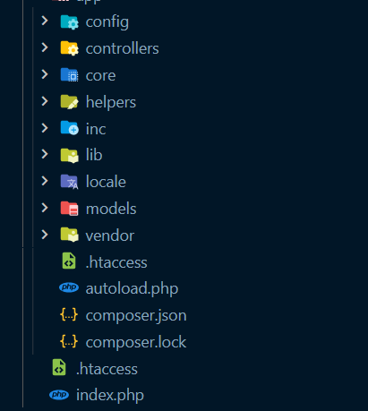
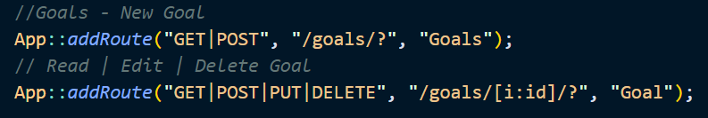
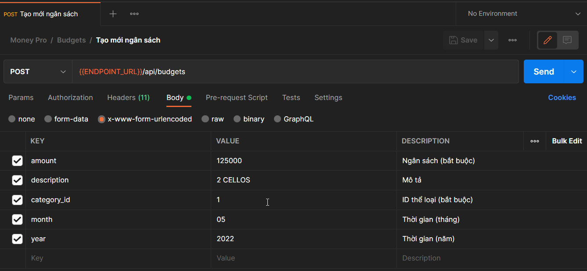
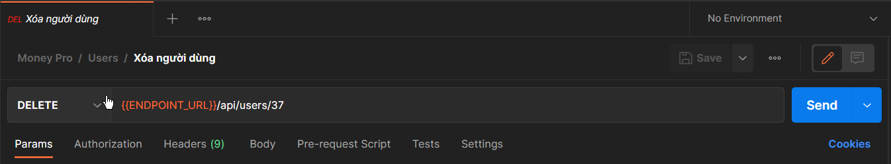

<h1 align="center">Phát Triển Phần Mềm Hướng Dịch Vụ - Phần API 
    Đề tài: Quản Lý Tài Chính Cá Nhân
</h1>

    

# [**Table Of Content**](#table-of-content)
- [**Table Of Content**](#table-of-content)
- [**Introduction**](#introduction)
- [**Architecture**](#architecture)
- [**Pattern**](#pattern)
- [**Example**](#example)
  - [**🟢GET**](#get)
  - [**🟡POST**](#post)
  - [**🔵PUT**](#put)
  - [**🟠PATCH**](#patch)
  - [**🔴DELETE**](#delete)
- [**Timeline**](#timeline)
  - [**Phase 1: 10-01-2022 to 19-02-2022**](#phase-1-10-01-2022-to-19-02-2022)
  - [**Phase 2: 22-02-2022 to 17-04-2022**](#phase-2-22-02-2022-to-17-04-2022)
  - [**Phase 3: 18-04-2022 to 20-05-2022**](#phase-3-18-04-2022-to-20-05-2022)
- [**Our Team**](#our-team)
- [**Made with 💘 and PHP **](#made-with--and-php-)

# [**Introduction**](#introduction)
Đây là phần tài liệu chuyên biệt để mô tả API đã được nhóm mình xây dựng cho môn Phát Triển Phần Mềm Hướng Dịch Vụ do thầy Huỳnh Trung Trụ hướng dẫn. Tài liệu này chỉ tập trung vào mô tả cấu trúc, cách sử dụng và những lưu ý cần thiết nhất khi sử dụng API này. 

API này được xây dựng để phát triển ứng dụng đa nền tảng. Với môn học này, chúng mình xây dựng ứng dụng trên 3 nền tảng chuyên biệt là 

- [**Restful API**](https://github.com/Phong-Kaster/PTIT-Phat-Trien-Phan-Mem-Huong-Dich-Vu-API#)

- [**Website**](https://github.com/Phong-Kaster/PTIT-Phat-Trien-Phan-Mem-Huong-Dich-Vu-Website)

- [**Android**](https://github.com/Phong-Kaster/PTIT-Phat-Trien-Ung-Dung-Di-Dong-Cuoi-Ki)

- [**iOS**](#)

# [**Architecture**](#architecture)

    

<h3 align="center">

***Cấu Trúc Cây Thư Mục API được xây dựng theo mô hình Restful API***
</h3>

Hình minh họa bên trên là cấu trúc cây thư mục, API này được xây dựng theo cấu trúc nổi tiếng, kinh điển là Model-View-Controller hay MVC. Và theo chuẩn cấu trúc RestfulAPI - mục đích của môn học này.

Tuy có rất nhiều thư mục khác nhau nhưng chúng ta hãy dành sự chú ý tới những thư mục & tệp tin sau:

- Thư mục **Controllers** - chứa các xử lý chính của API, mọi kết quả được trả về dạng JSON.

- Tệp tin **/inc/routes.inc.php** - nơi quy ước đường dẫn với từng Controller. Ví dụ: tạo mới giao dịch thì dùng Controller nào ? Hàm chức năng nào sẽ được gọi tới ? Tất cả do tệp tin này quy ước.

- Thư mục **Models** - chứa định nghĩa của các đối tượng chính trong cơ sở dữ liệu của chúng mình.

# [**Pattern**](#pattern)

Trước khi có thể đọc hiểu được một tài liệu API của bất kì ứng dụng nào, chúng ta sẽ cần phải hiểu về cấu trúc của một đường dẫn xử lý trong ứng dụng.

Ví dụ, với đề tài của nhóm mình, một đường dẫn sẽ có hình thức như sau

    

<h3 align="center">

***Ví dụ về đường dẫn trong API***
</h3>

Dự án này được xây dựng bằng ngôn ngữ `PHP` thuần, không sử dụng bất kì framework nào hết 🥱. 
Các bạn có thể không quen về cú pháp của ngôn ngữ nhưng với kinh nghiệm học lập trình. Mình tin là hầu hết các bạn sẽ hiểu được ý nghĩa của ví dụ bên trên.

> Note: Dấu hỏi chấm (?) mang ý nghĩa là tại vị trí này có thể là một chuỗi kí tự bất kì hoặc không có gì

Chúng ta có thể dễ dành viết thành dạng cú pháp như sau:

    App::addRoute( <Phương thức> , <Đường dẫn> , <Tên hàm xử lý> );

Trong đó cú pháp bên trên các thành phần sẽ có ý nghĩa như sau:

**<Phương thức>** là tên các phương thức mà đường dẫn này sẽ hồ trợ.

**<Đường dẫn>** là đường dẫn trên trình duyệt để gọi tới các hàm sử ý trong Controller. Bạn có thể viết bất cứ đường dẫn nào cũng được. Miễn đường dẫn có thể dễ hiểu, dễ nhớ, dễ dò lỗi nếu xảy ra sự cố,...

**<Tên hàm xử lý>** là tên của controller được gọi để xử lý dữ liệu. Thứ sẽ được người dùng gửi tới máy chủ của chúng ta. Ví dụ: Account Controller, Setting Controller,...

Ở phần tiếp theo mình sẽ ví dụ cụ thể bao gồm cả 4 phương thức với từng ví dụ cụ thể để các bạn có thể hiểu rõ cách thức hoạt động của từng API

# [**Example**](#example)

Vì API này được xây dựng theo chuẩn RestfulAPI nên nó hỗ trợ đầy đủ các phương pháp phổ biến, nhiều người dùng nhất.

> Để dễ nhận biết giữa các phương thức, tên mỗi phương thức sẽ đi kèm 1 chấm tròn có màu riêng biệt để các bạn tiện theo dõi hơn😛😛

Các phương thức API này hỗ trợ bao gồm:

🟢 **GET** - Để truy xuất một tài nguyên. Ví dụ: lấy thông tin 1 giao dịch thì dùng phương thức **GET**

🟡 **POST** - Để tạo một tài nguyên trên máy chủ. Ví dụ: tạo mới một tài khoản

🔵 **PUT** - Để thay đổi trạng thái toàn bộ một tài nguyên hoặc để cập nhật nó. Ví dụ: thay đổi mật khẩu, tên hiển thị 

🟠 **PATCH** - Giống `PUT` nhưng PATCH thường dùng trong trường hợp sửa 1 phần của tài nguyên.

🔴 **DELETE** - Để huỷ bỏ hoặc xoá một tài nguyên. Ví dụ: xóa hoàn toàn một thể loại, bài viết,...

Legen wir los 🔥(Let's go)

## [**🟢GET**](#get)

    App::addRoute("GET", "/budgets/?", "Budgets");

Chắc chắn rồi! Đây là phương thức phổ biến nhất và được sử dụng nhiều nhất trên Internet. 

`GET` là phương thức sẽ gửi yêu cầu tới máy chủ để lấy dữ liệu & trả về phía người dùng. Trong ví dụ này, câu lệnh trên sẽ yêu cầu trả về danh sách toàn bộ các kinh phí (budget) trong tài khoản của người dùng.

Trong ví dụ này trên sẽ bao gồm:

**GET** là tên phương thức chúng ta gửi tới máy chủ

**/butgets/?** là tên đường dẫn chúng ta sẽ cần để gọi ra được yêu cầu in toàn bộ danh sách.

**Budgets** là tên Controller được gọi tới để xử lý yêu cầu này

Những đường dẫn sau là hợp lệ để gọi tới phương thức này:

Ví dụ 1: 

    https://phong-kaster.com/budgets
    
Ví dụ 2: 

    https://phong-kaster.com/budgets/hallo-mein-Name-ist-Phong

Ví dụ 3: 

    https://phong-kaster.com/budgets/?

## [**🟡POST**](#post)

Phổ biến chỉ sau phương thức `GET` là phương thức `POST`. Phương thức này dùng để gửi dữ liệu từ người dùng lên máy chủ để xử lý. 

Trước đây, khi chưa biết tới chuẩn Restful API. Có lẽ, Phong cũng giống rất nhiều các bạn, làm website chỉ dùng mỗi 2 phương thức GET & POST. Với phương thức POST, các bạn có lẽ sẽ gửi kèm với dữ liệu lên server một biến để phân biệt hành động thêm - xóa - sửa.

Ví dự, mỗi khi gửi dữ liệu đi, Phong sẽ đính kèm một biến là **action**. Biến action này có thể mang giá trị **create**, **delete**, **edit** để phân biệt cách xử lý.

Tuy nhiên, trong ví dụ dưới đây, sẽ không có biến nào mang vai trò như biến action hết. Đường dẫn dưới đây chỉ mang một ý nghĩa duy nhất là tạo mới một đối tượng:
    
    App::addRoute("POST", "/budgets/?", "Budgets");

Trong ví dụ này trên sẽ bao gồm:

**POST** là tên phương thức chúng ta gửi tới máy chủ

**/butgets/?** là tên đường dẫn chúng ta sẽ cần để gọi ra được yêu cầu tạo mới một đối tượng.

**Budgets** là tên Controller được gọi tới để xử lý yêu cầu 

    

<h3 align="center">

***Gửi dữ liệu với phương thức POST bằng Postman***
</h3>

## [**🔵PUT**](#put)

Phương thức `PUT` được sử dụng khi chúng ta có nhu cầu muốn thay đổi thông tin của một đối tượng đã tồn tại. Ví dụ: muốn thay đổi họ tên sinh viên thì dùng phương thức này.

    App::addRoute("PUT", "/goals/[i:id]/?", "Goal");

Trong ví dụ này trên sẽ bao gồm:

**PUT** là tên phương thức chúng ta gửi tới máy chủ

**/goals/[i:id]/?** là tên đường dẫn chúng ta sẽ cần để gọi ra được yêu cầu in toàn bộ danh sách. Trong đó, đoạn **/[i:id]/?** là cách để trúng ta gửi đi ID - mã định danh của đối tượng chúng ta muốn thay đổi, cập nhật nó.
Trong PHP, để gọi nó, chúng ta sử dụng câu lệnh `Routes->params->id`.

**Goal** là tên Controller được gọi tới để xử lý yêu cầu 

Nếu ID được cung cấp là chính xác, những đường dẫn sau là hợp lệ để gọi tới phương thức này:

Ví dụ 1: 

    https://phong-kaster.com/goals/147
    
Ví dụ 2: 

    https://phong-kaster.com/goals/147/hallo-mein-Name-ist-Phong

Ví dụ 3: 

    https://phong-kaster.com/goals/147/?

## [**🟠PATCH**](#patch)

Tương tự như `PUT` nhưng PATCH thường dùng trong trường hợp sửa một phần của tài nguyên. Giống [**PUT**](#put) quá nên các bạn đọc ví dụ của PUT giúp mình nhé🤗🤗 

## [**🔴DELETE**](#delete)

Như tên gọi của mình, `DELETE` là phương thức được gọi để xóa hoàn toàn một tài nguyên khỏi máy chủ.

    App::addRoute("DELETE", "/users/[i:id]/?", "Goal");

Trong ví dụ này trên sẽ bao gồm:

**DELETE** là tên phương thức chúng ta gửi tới máy chủ

**/users/[i:id]/?** là tên đường dẫn chúng ta sẽ cần để gọi ra được yêu cầu xóa. Trong đó, đoạn **/[i:id]/?** là cách để trúng ta gửi đi ID - mã định danh của đối tượng chúng ta muốn xóa.
Trong PHP, để gọi nó, chúng ta sử dụng câu lệnh `Routes->params->id`.

**Goal** là tên Controller được gọi tới để xử lý yêu cầu

    

<h3 align="center">

***Ví dụ xóa một đối tượng với phương thức DELETE trong Postman***
</h3>

> Note: Dấu hỏi chấm (?) mang ý nghĩa là tại vị trí này có thể là một chuỗi kí tự bất kì hoặc không có gì.

# [**Timeline**](#timeline)

## [**Phase 1: 10-01-2022 to 19-02-2022**](#phase-1-10-01-2022-to-19-02-2022)
Xây dựng API với các chức năng C.R.U.D cơ bản, chưa tinh chỉnh theo chuẩn Restful API

## [**Phase 2: 22-02-2022 to 17-04-2022**](#phase-2-22-02-2022-to-17-04-2022)
Tinh chỉnh lần lượt các Controller để theo chuẩn Restful API với 5 phương thức phổ biến nhất.

## [**Phase 3: 18-04-2022 to 20-05-2022**](#phase-3-18-04-2022-to-20-05-2022)
Hoàn thiện API và viết tài liệu.

# [**Our Team**](#our-team)

<table>
        <tr>
            <td align="center">
                <a href="https://github.com/Phong-Kaster">
                    
                     
                    <b>Nguyễn Thành Phong</b>
                </a>
            </td>
            <td align="center">
                <a href="https://github.com/ngdanghau">
                    
                     
                    <b>Nguyễn Đăng Hậu</b>
                </a>
            </td>
            <td align="center">
                <a href="https://github.com/chungnv0501">
                    
                     
                    <b>Nguyễn Văn Chung</b>
                </a>
            </td>
            <td align="center">
                <a href="#">
                    
                     
                    <b>Lương Đình Khang</b>
                </a>
            </td>
            <td align="center">
                <a href="#">
                    
                     
                    <b>Hoàng Đức Thuận</b>
                </a>
            </td>
        </tr>
</table>
 
# [**Made with 💘 and PHP **](#made-with-love-and-php)