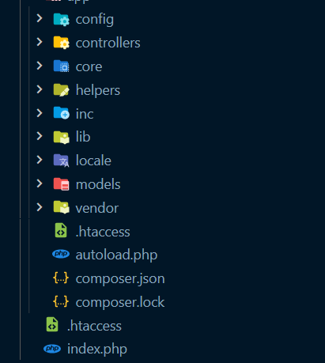

<h1 align="center">API Phát Triển Phần Mềm Hướng Dịch Vụ 
    Đề tài: Quản Lý Tài Chính Cá Nhân
</h1>

    

# [**Table Of Content**](#table-of-content)
- [**Table Of Content**](#table-of-content)
- [**Introduction**](#introduction)
- [**Architecture**](#architecture)
- [**Methods**](#methods)
- [**Timeline**](#timeline)
  - [**Phase 1: 10-01-2022 to 19-02-2022**](#phase-1-10-01-2022-to-19-02-2022)
  - [**Phase 2: 22-02-2022 to 17-04-2022**](#phase-2-22-02-2022-to-17-04-2022)
- [**Our Team**](#our-team)
- [**Made with 💘 and PHP **](#made-with--and-php-)

# [**Introduction**](#introduction)
Đây là phần tài liệu chuyên biệt để mô tả API đã được nhóm mình xây dựng cho môn Phát Triển Phần Mềm Hướng Dịch Vụ do thầy Huỳnh Trung Trụ hướng dẫn. Tài liệu này chỉ tập trung vào mô tả cấu trúc, cách sử dụng và những lưu ý cần thiết nhất khi sử dụng API này. 

API này được xây dựng để phát triển ứng dụng đa nền tảng. Với môn học này, chúng mình xây dựng ứng dụng trên 3 nền tảng chuyên biệt là 

- [**Website**](#)

- [**Android**](#)

- [**iOS**](#)

# [**Architecture**](#architecture)

    

<h3 align="center">

***Cấu Trúc Cây Thư Mục API được xây dựng theo mô hình Restful API***
</h3>

Hình minh họa bên trên là cấu trúc cây thư mục, API này được xây dựng theo cấu trúc nổi tiếng, kinh điển là Model-View-Controller hay MVC. Và theo chuẩn cấu trúc RestfulAPI - mục đích của môn học này.

Tuy có rất nhiều thư mục khác nhau nhưng chúng ta hãy dành sự chú ý tới những thư mục & tệp tin sau:

- Thư mục Controllers - chứa các xử lý chính của API, mọi kết quả được trả về dạng JSON.

- Tệp tin /inc/routes.inc.php - nơi quy ước đường dẫn với từng Controller. Ví dụ: tạo mới giao dịch thì dùng Controller nào ? Hàm chức năng nào sẽ được gọi tới ? Tất cả do tệp tin này quy ước.

- Thư mục Models - chứa định nghĩa của các đối tượng chính trong cơ sở dữ liệu của chúng mình.

# [**Methods**](#methods)

Vì API này được xây dựng theo chuẩn RestfulAPI nên nó hỗ trợ đầy đủ các phương pháp phổ biến, nhiều người dùng nhất.

> Để dễ nhận biết giữa các phương thức, tên mỗi phương thức sẽ đi kèm 1 chấm tròn có màu riêng biệt để các bạn tiện theo dõi hơn😛😛

Các phương thức API này hỗ trợ bao gồm

🟢 **GET** - Để truy xuất một tài nguyên. Ví dụ: lấy thông tin 1 giao dịch thì dùng phương thức **GET**

🟡 **POST** - Để tạo một tài nguyên trên máy chủ. Ví dụ: tạo mới một tài khoản

🔵 **PUT** - Để thay đổi trạng thái một tài nguyên hoặc để cập nhật nó. Ví dụ: thay đổi mật khẩu, tên hiển thị 

🔴 **DELETE** - Để huỷ bỏ hoặc xoá một tài nguyên. Ví dụ: xóa hoàn toàn một thể loại, bài viết,...

# [**Timeline**](#timeline)

## [**Phase 1: 10-01-2022 to 19-02-2022**](#phase-1-10-01-2022-to-19-02-2022)
Xây dựng API với các chức năng C.R.U.D cơ bản, chưa tinh chỉnh theo chuẩn Restful API

## [**Phase 2: 22-02-2022 to 17-04-2022**](#phase-2-22-02-2022-to-17-04-2022)
Tinh chỉnh lần lượt các Controller để theo chuẩn Restful API với 5 phương thức phổ biến nhất.

# [**Our Team**](#our-team)

<table>
        <tr>
            <td align="center">
                <a href="https://github.com/Phong-Kaster">
                    
                     
                    <b>Nguyễn Thành Phong</b>
                </a>
            </td>
            <td align="center">
                <a href="https://github.com/ngdanghau">
                    
                     
                    <b>Nguyễn Đăng Hậu</b>
                </a>
            </td>
            <td align="center">
                <a href="https://github.com/chungnv0501">
                    
                     
                    <b>Nguyễn Văn Chung</b>
                </a>
            </td>
            <td align="center">
                <a href="#">
                    
                     
                    <b>Lương Đình Khang</b>
                </a>
            </td>
            <td align="center">
                <a href="#">
                    
                     
                    <b>Hoàng Đức Thuận</b>
                </a>
            </td>
        </tr>
</table>
 
# [**Made with 💘 and PHP **](#made-with-love-and-php)